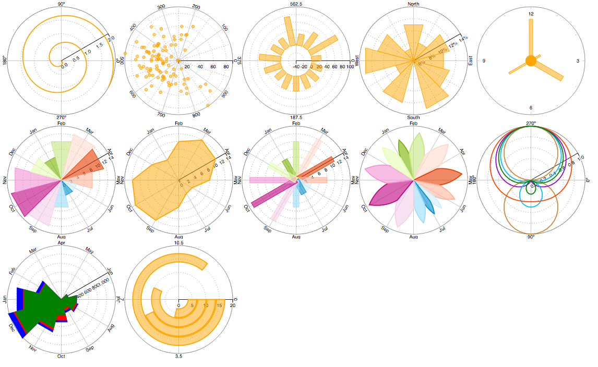
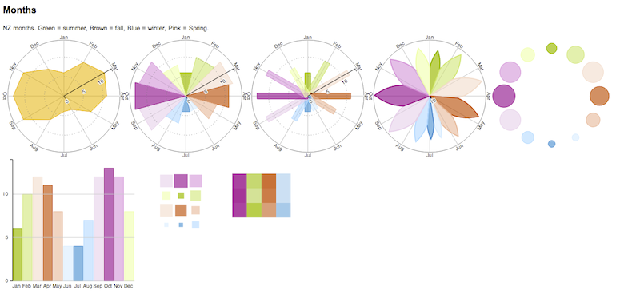

# react-polar-gg

!!WIP!!

Grammar of graphics inspired visualisations for VanillaJS and React.

[Kite library](https://github.com/widged/kite) ported to react

## Preview

Plotting monthly statistics on different coordinates

## Develop

    npm run start

## Build

     npm run build
     open build/index.html

## Usage

     npm run build
     open build/index.html

See
* renderer-react-svg/usage
* renderer-vanilla-svg/usage

## Tests

     npm test

## Author

Marielle Lange @widged

## Credits

Polar plots adapted from @biovisualise micropolar library.
